<p align="center">
  
</p>

<h1 align="center">F E N N E C</h1>

<h4 align="center"><b>Fennec</b> est une application open source d’audit de sécurité des serveurs avec support IA.</h4>

<p align="center">
    
    
    
    
</p>

<p align="center">
    <a href="#fonctionnalites">Fonctionnalités</a> •
    <a href="#installation">Installation</a> •
    <a href="#usage">Utilisation</a> •
    <a href="#audit">Audit</a> •
    <a href="#intelligence-artificielle-ia">IA</a> •
    <a href="#contribution">Contribution</a> •
    <a href="#licence">Licence</a>
</p>


# Fonctionnalités

Fennec offre un ensemble complet de fonctionnalités pour faciliter l’audit et la gestion de la sécurité des serveurs :

1. **Audit automatique des services**

   * Vérifie la configuration des services principaux : **SSH, Apache, Webmin, MariaDB**.
   * Compare les paramètres aux standards **CIS Benchmarks** et aux recommandations nationales **DGSSI (Maroc)**.

2. **Agent distant sécurisé**

   * Déploiement d’un agent via script `deploy_agent.sh`.
   * Communication sécurisée avec le serveur grâce à une clé publique.
   * Création d’un utilisateur temporaire automatiquement supprimé après 24h ou lors d’une nouvelle exécution.

3. **Tableau de bord moderne**

   * Visualisation des informations du serveur : **IP, OS, VPN, CPU, RAM, uptime**, et autres métriques essentielles.
   * Statut en temps réel de l’agent et des audits réalisés.

4. **Explications intelligentes avec IA**

   * Utilisation de **Meta Llama 4 Maverick** via OpenRouter pour expliquer les résultats d’audit.
   * Recommandations détaillées pour corriger les problèmes détectés.
   * Réduit le besoin de documentation longue et complexe.

5. **Open source et personnalisable**

   * Projet libre et modifiable pour ajouter de nouveaux services ou améliorer les fonctionnalités.
   * Facilement extensible pour s’adapter à d’autres environnements ou standards.

6. **Sécurité intégrée**

   * Vérification de l’intégrité du script d’agent avec un hash.
   * Transmission des données en toute sécurité via SSH.

# Installation 

Fennec est une application web moderne combinant **React.js** (frontend), **FastAPI** (backend Python) et **SQLite** (base de données légère). Suivez ces étapes pour un déploiement rapide et professionnel :

## Prérequis

* **Node.js ≥16** → [Node.js](https://nodejs.org/en/download)
* **Python ≥3.9** → [Python](https://www.python.org/downloads/)
* **SQLite3** (intégré par défaut sur la plupart des systèmes)

## Backend (FastAPI)

```bash
cd backend

# Créer un environnement virtuel
python -m venv backend-venv

# Activer l'environnement
# Linux/macOS
source backend-venv/bin/activate
# Windows
backend-venv\Scripts\activate

# Installer les dépendances
pip install -r requirements.txt

# Lancer le serveur FastAPI
uvicorn app.main:app --reload
```

## Frontend (React.js)

```bash
cd frontend
npm install
npm run dev
```

## Configuration de l’IA

Définissez la clé OpenRouter pour le modèle IA :

```bash
export OPENROUTER_API_KEY="votre_cle_api"
```

> Windows PowerShell : `setx OPENROUTER_API_KEY "votre_cle_api"`

## Conseils professionnels

* Utilisez un environnement virtuel pour isoler les dépendances Python.
* Vérifiez que le port utilisé par FastAPI n’est pas bloqué par un firewall.
* Supprimez la base SQLite (`database.db`) après les tests pour repartir sur une instance propre.

> Vous êtes maintenant prêt à utiliser Fennec pour auditer vos serveurs avec une interface moderne et des recommandations IA intelligentes.

# Utilisation

Cette section explique pas à pas comment utiliser **Fennec** pour lancer votre premier audit de sécurité.

## Connexion

* Identifiants par défaut :

  * **Utilisateur** : `admin`
  * **Mot de passe** : `admin`

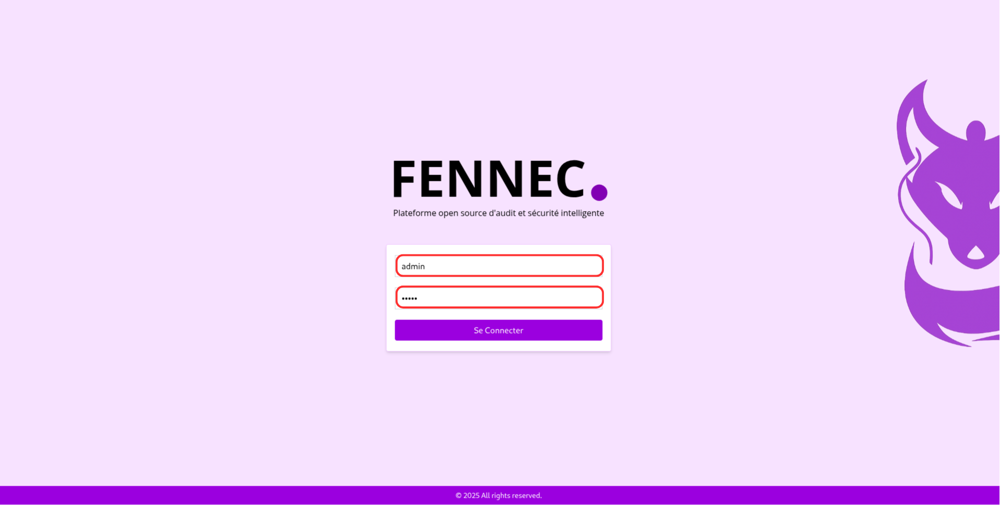

* ⚠️ Pour l’instant, il n’est pas possible de modifier ces informations.

## Création du premier agent

1. Depuis la page **Guide d’utilisation**, cliquez sur **Créer votre premier agent**.

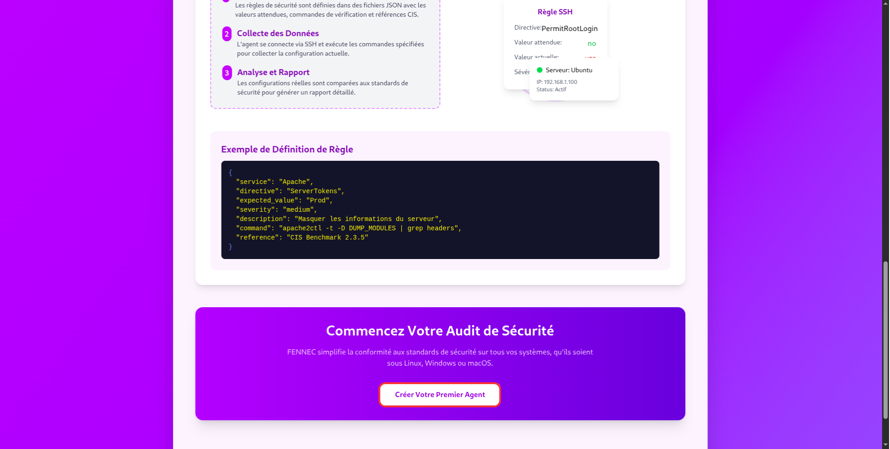

2. Actuellement, un seul agent peut être créé.
3. Le tableau de bord sera vide au départ : cliquez sur **Déployer** pour commencer la configuration.

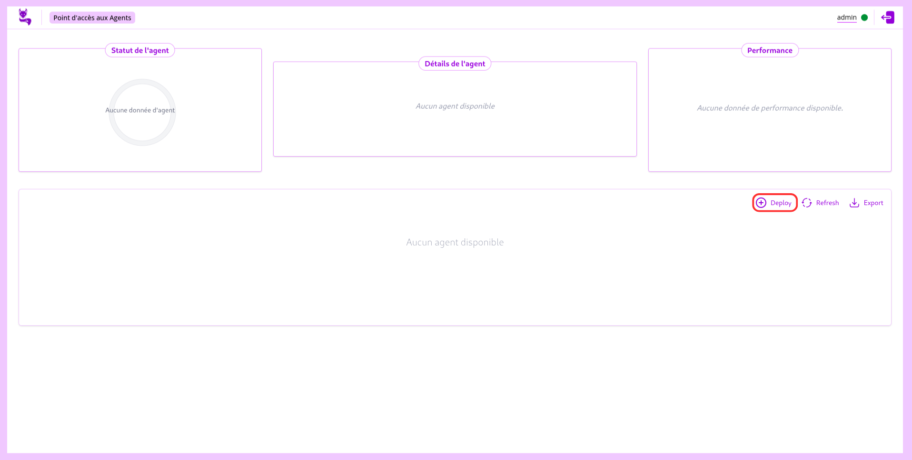

## Préparation de la clé SSH

Avant de déployer l’agent, il faut récupérer votre clé publique SSH :

```bash
cat ~/.ssh/id_edxxxx.pub
```

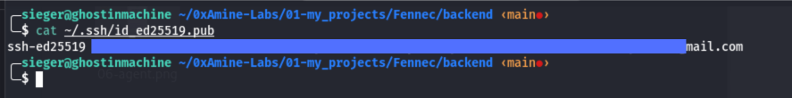

> Remplacez `id_edxxxx.pub` par le nom correct de votre fichier de clé publique.

## Déploiement de l’agent

1. Dans l’application, saisissez :

   * **Adresse IP** du serveur cible.
   * **Port SSH** (par défaut : `22`).
   * **Clé publique SSH**.


2. Cliquez sur **Générer le script de déploiement**.
3. Après quelques secondes, vous pouvez télécharger :
   * Le script de déploiement : `deploy_agent.sh`
   * Le fichier de hash pour vérification d’intégrité.

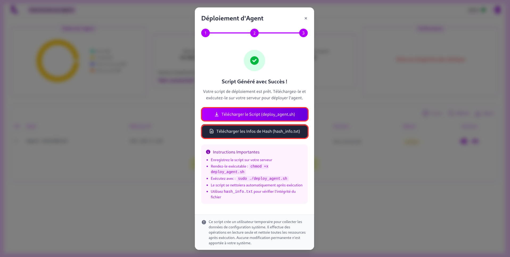

## Installation sur le serveur

1. Transférez le script sur le serveur par la méthode de votre choix (**scp**, **rsync**, etc.).
2. Donnez les permissions d’exécution :

```bash
chmod +x deploy_agent.sh
```

3. Exécutez le script avec les droits administrateur :

```bash
sudo ./deploy_agent.sh
```

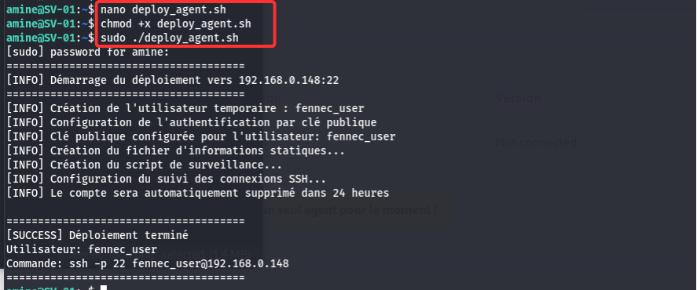

## Activation de l’agent

* Une fois le script exécuté, l’agent sera actif.
* Revenez sur le tableau de bord Fennec et cliquez sur **Rafraîchir** pour voir l’agent en ligne.

Vous êtes maintenant prêt à lancer votre premier audit et explorer les résultats avec l’assistant IA intégré.

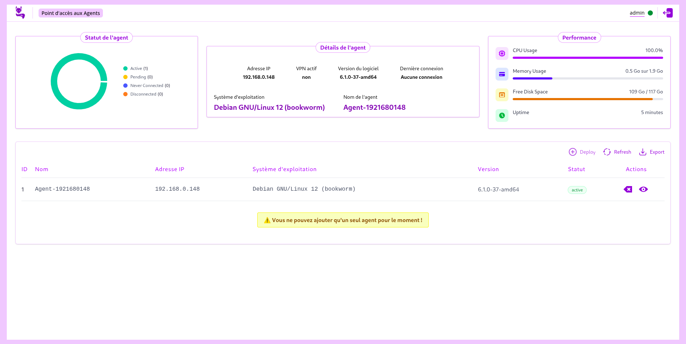

# Audit

Cette section décrit comment effectuer un audit complet avec **Fennec**.

## Accéder à l’audit

1. Depuis le tableau de bord, sélectionnez un agent actif.

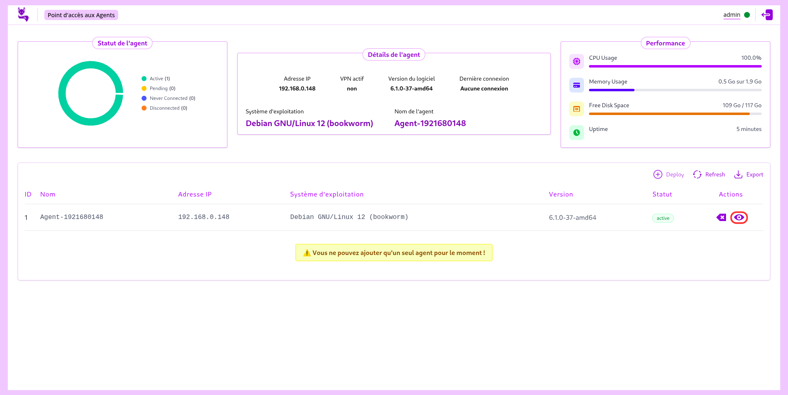

2. Cliquez sur l’action **« Voir l’audit des services »**.

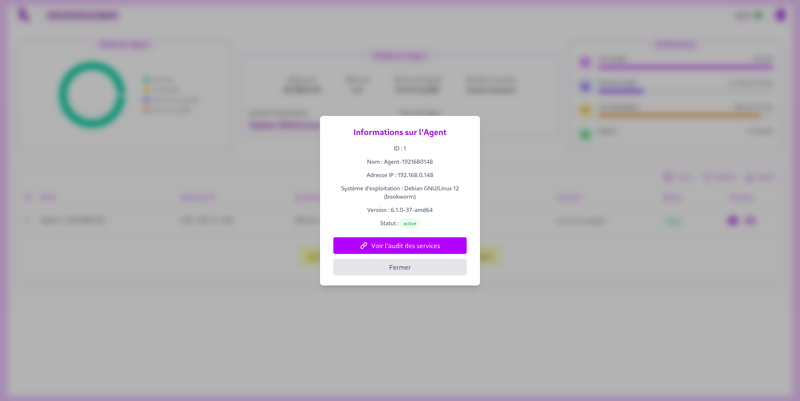

3. La page d’audit s’ouvre et affiche :

   * Les services détectés en cours d’exécution (ex. : SSH, Apache, Webmin, MariaDB).
   * Leurs configurations analysées selon les normes internationales (CIS) et nationales (DGSSI Maroc).

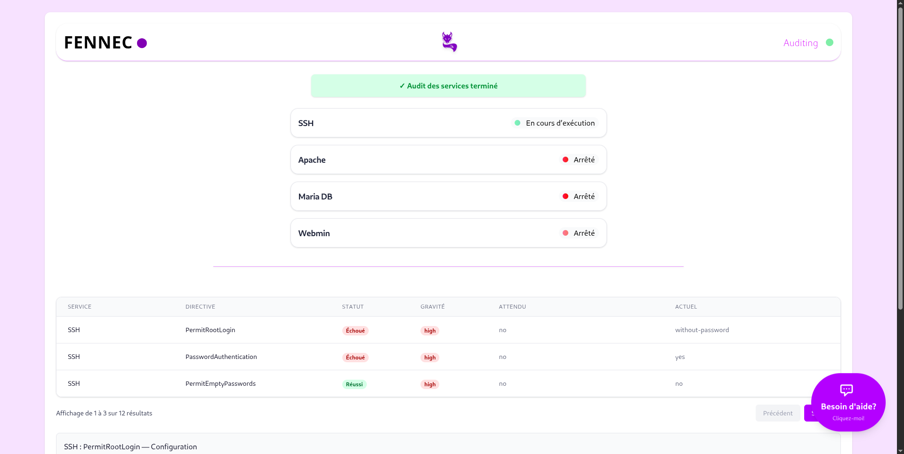

## Résultats d’audit

* Chaque service audité présente :

  * Les directives vérifiées.
  * Les éventuelles erreurs ou écarts de configuration.
  * Une référence vers les documents de conformité associés.

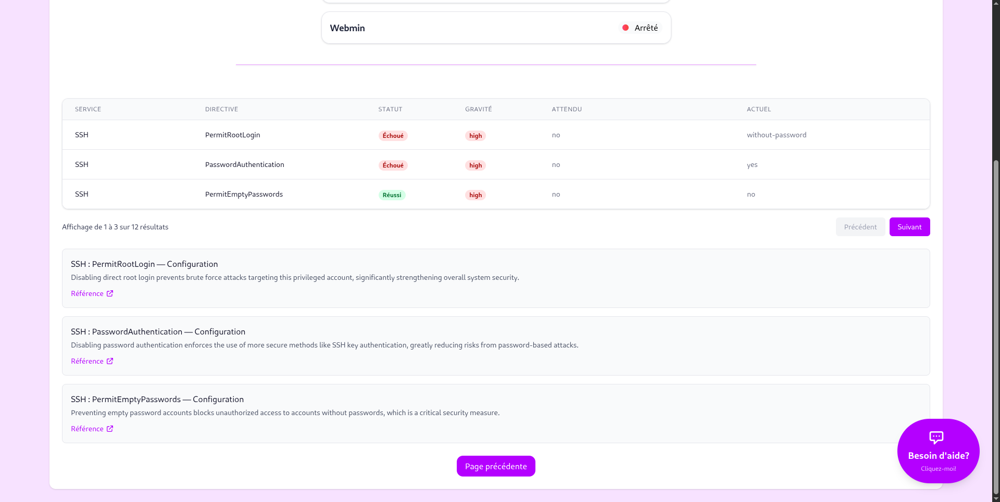

## Assistant IA

* Après un court délai, un **chatbot** apparaît à l’écran.
* En cliquant dessus, vous obtenez une explication simplifiée des erreurs détectées, ainsi que des recommandations.
* Cependant, il est **fortement recommandé** de toujours consulter les références officielles pour une compréhension complète.

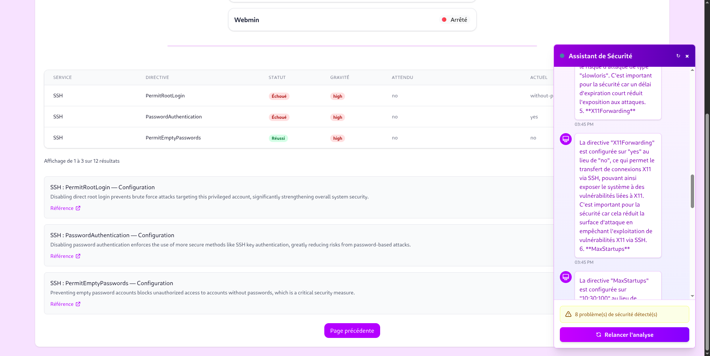

## Recommandation importante

Après chaque audit, et une fois votre analyse terminée, il est **recommandé de supprimer le fichier `database.db`** généré par l’application. Cela permet d’assurer :

* La confidentialité des résultats.
* Une meilleure hygiène de sécurité.
* Un nouvel état propre lors des prochains audits.

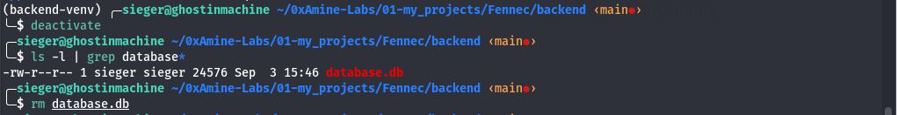

# Intelligence Artificielle (IA)

La phase **IA** de Fennec vise à simplifier la compréhension des résultats d’audit en s’appuyant sur un modèle de langage avancé (**Meta LLaMA 4 Maverick** via OpenRouter).

## Objectif

* Fournir des explications claires et en français sur chaque erreur détectée.
* Éviter aux administrateurs de parcourir des documentations longues et complexes.
* Donner un premier niveau de recommandations immédiates.

## Fonctionnement

1. Lorsqu’un audit est terminé, les directives échouées sont collectées et envoyées à l’IA.
2. L’IA analyse ces données et génère pour chaque directive :

   * Le **nom de la directive**.
   * Une **explication brève** (2-3 phrases).
   * L’**importance de la directive** pour la sécurité.
3. Les résultats sont ensuite affichés sous forme de réponses interactives dans l’application.

## Exemple d’implémentation (extrait du code)

```python
from openai import OpenAI
import os, json

# Récupération de la clé API depuis la variable d’environnement
client = OpenAI(
    base_url="https://openrouter.ai/api/v1",
    api_key=os.getenv("OPENROUTER_API_KEY"),
)

# Analyse des résultats d’audit
def analyze_security_audit(audit_data):
    failed_audits = [a for a in audit_data if not a.get("passed", True)]
    if not failed_audits:
        return "Aucun problème de sécurité détecté."

    audit_json = json.dumps(failed_audits, indent=2)

    prompt = f"""
    Analysez ce rapport d'audit et expliquez chaque directive échouée.

    Données:
    {audit_json}

    Pour chaque directive :
    1. Nom
    2. Explication (2-3 phrases)
    3. Importance sécurité
    """

    completion = client.chat.completions.create(
        model="meta-llama/llama-4-maverick:free",
        messages=[{"role": "user", "content": prompt}],
    )

    return completion.choices[0].message.content
```

## Avantages

* **Rapidité** : explication instantanée des erreurs.
* **Accessibilité** : simplification du langage technique.
* **Support interactif** : l’utilisateur peut interroger l’IA directement via le chatbot intégré.

---

Cette intégration fait de Fennec non seulement un outil d’audit, mais aussi un **assistant intelligent**, aidant à comprendre et corriger les failles de sécurité efficacement.

# Contribution

Fennec est un projet **open source** et nous encourageons vivement la communauté à contribuer pour l’améliorer.

## Comment contribuer ?

1. **Forkez** le projet sur votre compte GitHub.
2. **Créez une branche** pour vos modifications :

   ```bash
   git checkout -b feature/ma-nouvelle-fonctionnalite
   ```
3. **Apportez vos changements** (ajouts, corrections, documentation).
4. **Committez et poussez** vos modifications :

   ```bash
   git commit -m "Ajout d'une nouvelle fonctionnalité"
   git push origin feature/ma-nouvelle-fonctionnalite
   ```
5. **Créez une Pull Request (PR)** vers la branche principale.

## Soumettre des suggestions ou rapports de bug

Si vous ne souhaitez pas contribuer directement au code, vous pouvez :

* Ouvrir une **issue** sur GitHub.
* Ou m’envoyer vos suggestions / rapports par email :
  📩 **[githubcontribution.impaired739@passinbox.com](mailto:githubcontribution.impaired739@passinbox.com)**

---

Ensemble, faisons de **Fennec** un outil toujours plus puissant et utile pour la communauté !

# Licence

Fennec est un projet **open source** visant à fournir un outil d’audit de sécurité puissant et accessible à tous.

En contribuant ou en utilisant ce projet, vous acceptez de respecter les principes de l’open source :
- Liberté d’utiliser et de modifier le logiciel.
- Possibilité de partager vos améliorations.
- Transparence et collaboration avec la communauté.

Pour le cadre légal précis, Fennec est distribué sous la **MIT License**. Consultez le fichier [LICENSE](./LICENSE) pour plus de détails.
